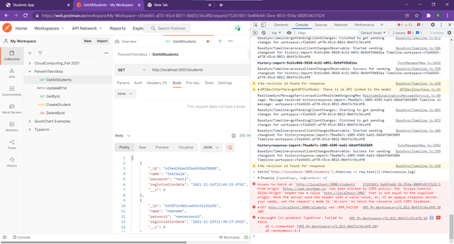
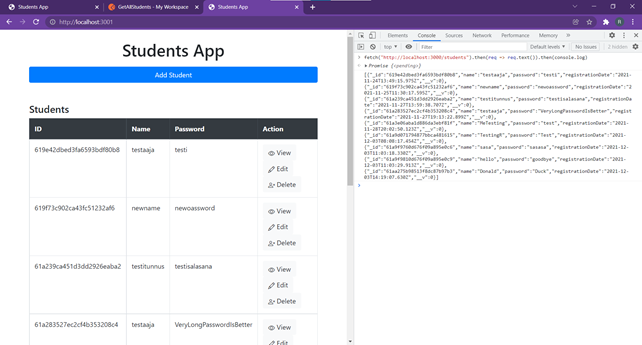
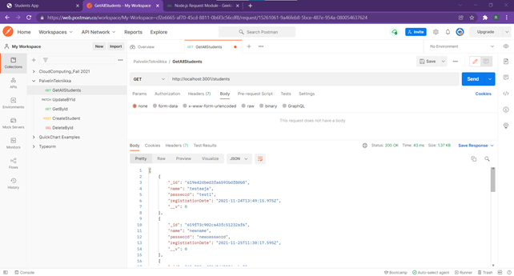
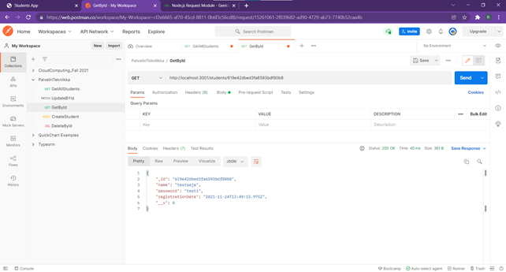
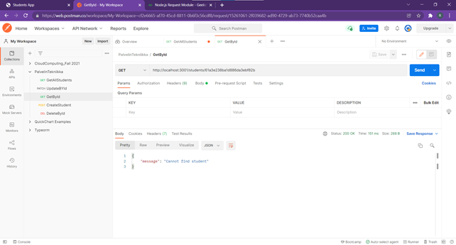
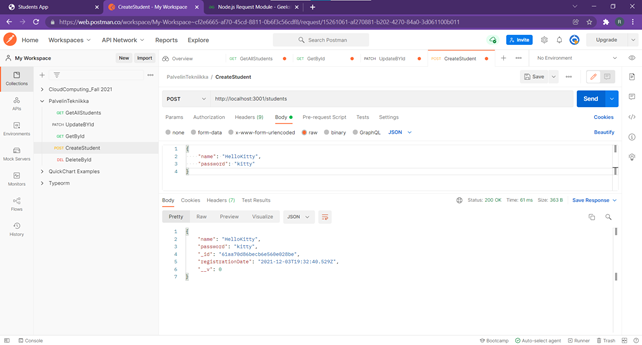
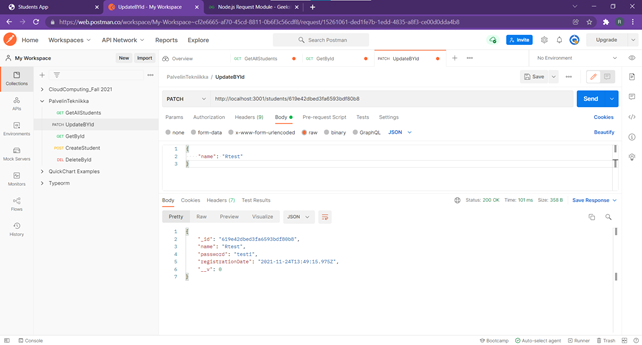
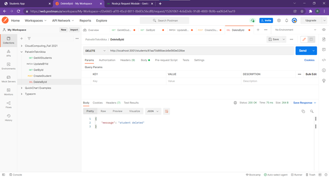

# Palvelintekniikat

## 1. Group Members

|Student Name  |email address  |number  |
|---------|---------|---------|
|Roula Almouayad Alazem     |      roula.almouayad.alazem@student.lab.fi   |    1901962    |
|Leo Hannolainen            |      leo.hannolainen@student.lab.fi |  2000505       |    
|Maxim Villival'd           |      maxim.villivald@student.lab.fi   | 1901968        |
|Timo Rautiainen            |      Timo.rautiainen@student.lab.fi  |     2095568    |
|Taneli Kiviranta           |      taneli.kiviranta@student.lab.fi    |     2095524    |


## 2. Git Reporsitory link

https://gitlab.com/TimoR91/palvelintekniikat.git


## 3. The Application

<p>&nbsp;</p>

### 3.1 Student Directory Application

The application is to handle students’ directory. 
<p>&nbsp;</p>

### 3.2 Application Description

The application has two APIs, api1 and api2, and the students records are saved into Mongo db. 

Api1 listens to port 3001 which receives request from frontend site, and forwards the request to api2.

Api2 listens to port 3000. Cors is configured to Api1, in which only api2 (localhost:3001) access it. 

<p>&nbsp;</p>


## 4. The Implimentation

### 4.1 Frontend

Frontend of the application was created using express-handlebars in Api1.

Therefore they both use common port 3001. 

Access the frontend page using localhost:3001

Frontend operations are introduced at: https://youtu.be/Ezo-RI0X5Ao

### 4.2 CORS

|   |
|:---:|
| CORS: trying to fetch from postman website not allowed |

|   |
|:---:|
| CORS: trying to fetch from localhost:3001 allowed |

<p>&nbsp;</p>

### 4.3 Request Methods

The application implements Get, Post, Patch and Delete methods. 

Api1 sends the requests to Api2 using the Request module. Api2 sends requests and fetch data from DB. 

#### 4.3.1. Get: 

to get all students data 

|   |
|:---:|
| *Postman: get all students' records* |

#### **api1 get**

````ts
app.get("/students", (req:Request, res:Response) => {
  request({
      method: "GET",
      url: url,
      json: true,
      headers: { "content-type": "application/json" }
    },
    (error:string, response:Response, body:string[]) => {
      !error && response.statusCode == 200 ? (students = body) : null
      res.json(body)
    }
  )
})
````
#### **api2 get**

````ts
router.get('/', async (req: Request, res: Response) => {
    try {
        const students = await Student.find()
        res.json(students)
    } catch (err: any) {
        //server error
        res.status(500).json({ message: err.message })
    }
})
````


#### 4.3.2. Get by Id: 

to get one student's records by Id 

|   |
|:---:|
| *Postman: get one student's record* |


|   |
|:---:|
| *Postman: get one student's record - Not found* |

#### **api1 getbyId**

````ts
aapp.get("/students/:id", (req:Request, res:Response) => {
  request({
      method: "GET",
      url: url + '/'+ req.params.id as string,
      json: true,
      headers: {
        "content-type": "application/json",
      }
    },
    (error:string, response:Response, body:string[]) => {
      !error && response.statusCode == 200 ? (students = body) : null
      console.log(response.statusMessage, response.statusCode)
      console.log(body)
      res.json(body)
    }
  )
})

````

#### **api2 getbyId**

````ts
router.get('/:id', getStudent, (req: Request, res: Response) => {
    res.json((<any>res).student)
})

````

#### 4.3.3. Post:

to create a new student with name and password. 

|   |
|:---:|
| *Postman: create a student's record* |

#### **api1 post**

````ts
app.post("/students", (req:Request, res:Response) => {
  request({
      method: "POST",
      url: url,
      json: true,
      headers: {
        "content-type": "application/json",
      },
      body: {
        name: req.body.name as string,
        password: req.body.password as string
      }
    },
    (error:string, response:Response, body:string[]) => {
      !error && response.statusCode == 201 ? (students = body) : null
      console.log(body)
      console.log(response.statusMessage, response.statusCode)
      res.json(body)
    }
  )
})

````

#### **api2 post**

````ts
router.post('/', async (req: Request, res: Response) => {
    const student = new Student({
        name: req.body.name,
        password: req.body.password
    })
    try {
        const newStudent = await student.save()
        // object created
        res.status(201).json(newStudent)
    } catch (err: any) {
        //bad data
        res.status(400).json({ message: err.message })
    }
})

````

#### 4.3.4. Patch:

finds a student with id and update name and/or password. 

|   |
|:---:|
| *Postman: update a student's record* |

#### **api1 patch**

````ts
app.patch("/students/:id", (req:Request, res:Response) => {
  let bodyProperties = {}

  if (req.body.name && req.body.password) {
    bodyProperties = {
      name: req.body.name as string,
      password: req.body.password as string
    }
  }
  else if (!req.body.name && req.body.password) {
    bodyProperties = {
      password: req.body.password as string
    }
  }
  else if (req.body.name && !req.body.password) {
    bodyProperties = {
      name: req.body.name as string
    }
  }
  
  request({
      method: "PATCH",
      url: url + '/'+ req.params.id as string,
      json: true,
      headers: { "content-type": "application/json" },
      body: bodyProperties
    },
    (error:string, response:Response, body:string[]) => {
      !error && response.statusCode == 200 ? (students = body) : null
      console.log(response.statusMessage, response.statusCode)
      console.log(body)
      res.json(body)
    }
  )
})

````

#### **api2 patch**

````ts
router.patch('/:id', getStudent, async (req: Request, res: Response) => {
    if (req.body.name != null) {
        (<any>res).student.name = req.body.name
    }
    if (req.body.password != null) {
        (<any>res).student.password = req.body.password
    }
    try {
        const updatedStudent = await (<any>res).student.save()
        res.json(updatedStudent)
    } catch (err: any) {
        res.status(400).json({ message: err.message })
    }
})

````

#### 4.3.5. Delete:

to delete a student with id 

|   |
|:---:|
| *Postman: delete a student's record* |

#### **api1 delete**

````ts
app.delete("/students/:id", (req:Request, res:Response) => {
  request({
      method: "DELETE",
      url: url + '/'+ req.params.id as string,
      json: true,
      headers: { "content-type": "application/json" }
    },
    (error:string, response:Response, body:string[]) => {
      !error && response.statusCode == 200 ? (students = body) : null
      console.log(body)
      res.json(body)
    }
  )
})

````
#### **api2 delete**

````ts
router.delete('/:id', getStudent, async (req: Request, res: Response) => {
    try {
        await (<any>res).student.remove()
        res.json({ message: 'student deleted' })
    } catch (err: any) {
        res.status(500).json({ message: err.message })
    }
})

````
